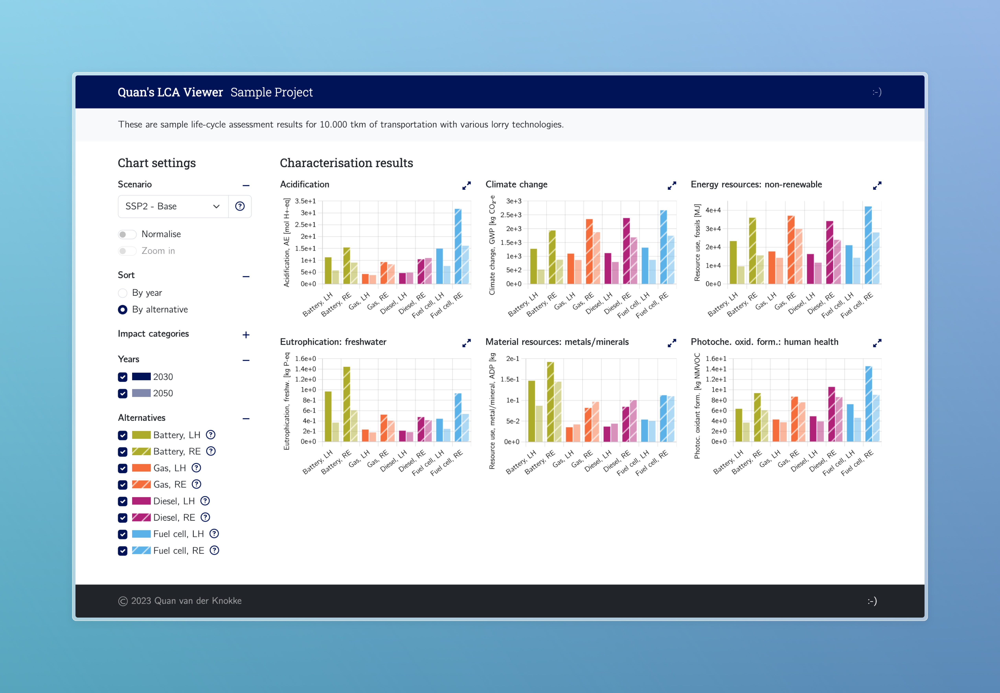

# Quan.LCAViewer

LCA Viewer, a small web application, for visualising, browsing and sharing LCA results exported from the [Activity Browser](https://github.com/LCA-ActivityBrowser/activity-browser).

Sample hosted on https://qlcav.quan.cat/sample.

## Features



Visualisation of characterisation and normalisation results, including the possiblity to showcase and filter on a wide array of alternatives, alternate scenarios, and multiple points in time. For an LCA practitioner, this facilitates the exploration of results and obtaining insights. For commissioners or interested parties, this can be a way to share LCA results in an interactive and easily accessible way, without the need to browse through reports or install software.


## How to use

LCA projects to visualise are hosted under `/data/project_name`. The file `/data/project_name/metadata.json` contains the configuration to load, including the data file paths (characterisation data CSV exports), setup and labelling of alternatives and impact categories, and theming.

A project can be loaded in the LCA Viewer by appending `?project=project_name` to the URL.


## Project Setup

```sh
npm install
```

### Compile and Hot-Reload for Development

Run the LCA Viewer locally to explore your own LCA data.

```sh
npm run dev
```

### Type-Check, Compile and Minify for Production

Build and host the LCA Viewer so project data can be shared. Project data is not bundled, so data can be updated without needing to rebuild and host the LCA Viewer itself.

```sh
npm run build
```

### Lint with [ESLint](https://eslint.org/)

```sh
npm run lint
```
